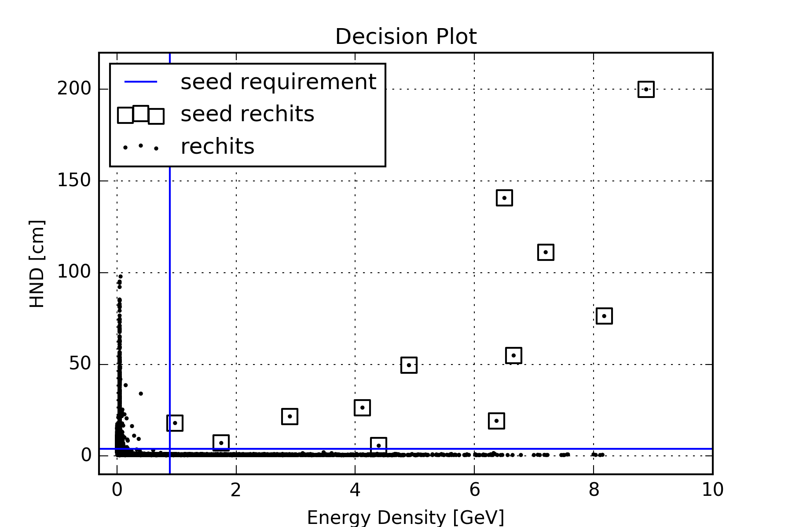
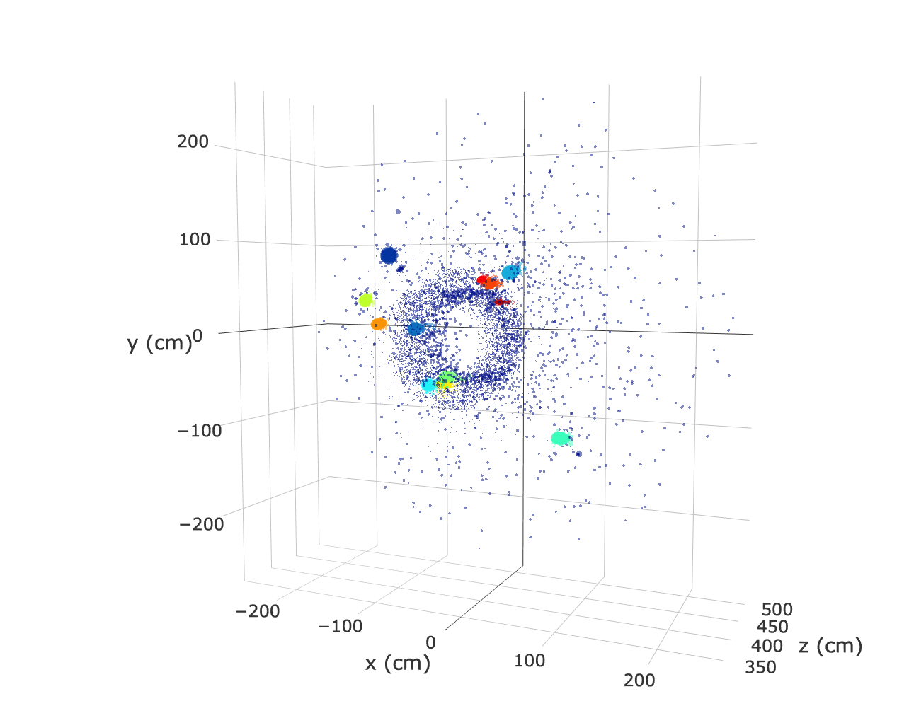
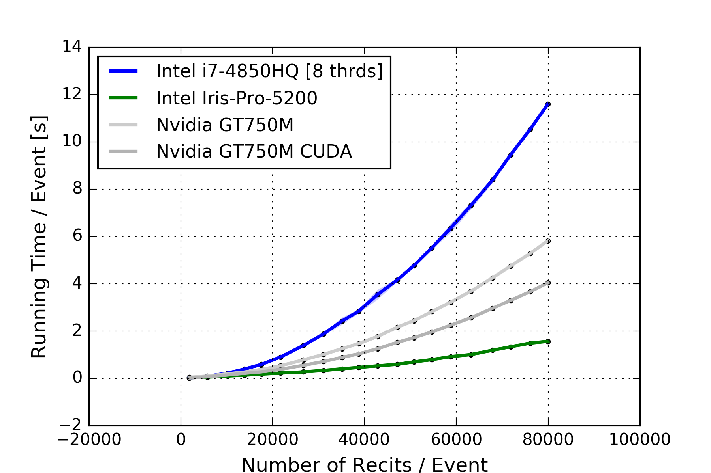
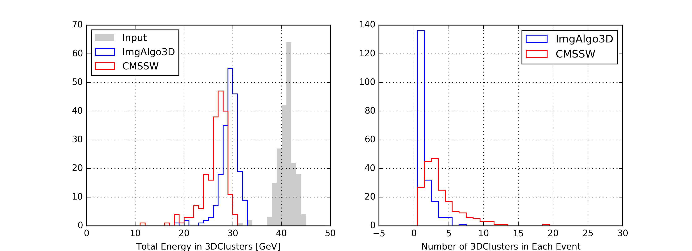
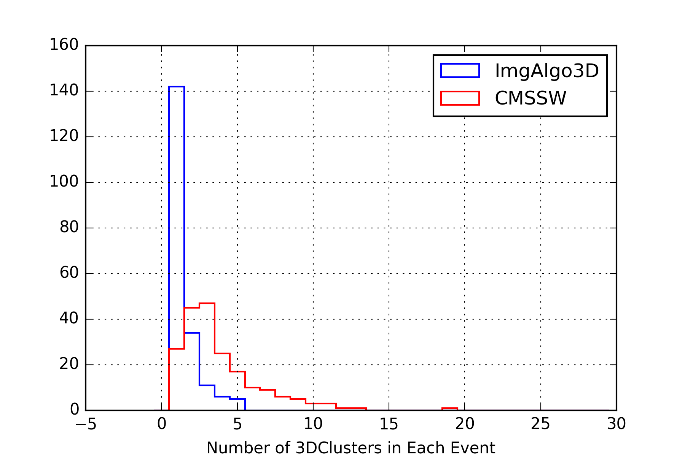
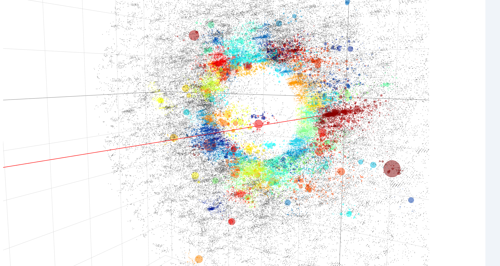

# ImageAlgorithm3D

A  simple [introduction page](https://galleryziheng.wordpress.com/2017/12/08/gpu-acceleration-of-imaging-algorithm/) for this project is [here](https://galleryziheng.wordpress.com/2017/12/08/gpu-acceleration-of-imaging-algorithm/)


The result of clustering based on Imaging Algorithm is the following
<p align="center">


</p>

The opencl implementation allows running imaging algorithm on CPU or GPU from NVIDIA, AMD and Intel.
<p align="center">

</p>

Imaging Algorithm, together with many well acknowleged clustering algortihm like DBSCAN, gives a guaranteed result with a complexity

```
O(N^2)   ---- without structual query of neighborhood

O(NlogN) ---- in average if structrual query of neighborhood
O(N^2)   ---- in worst case if structrual query of neighborhood
```

In the plot above, neighborhood query is done without structual query. And we can see the time complexity in general follows the N^2 tendency curve in CPU. If massively paralize the computation in GPU with N threads, the one gets a linear time complexity O(N) from O(N^2), on condition that N < GPU_CAPACITY.

If with structral query, one should expect time consumption as O(NlogN) on CPU and O(logN) on GPU.

<p align="center">


</p>

<p align="center">

</p>
